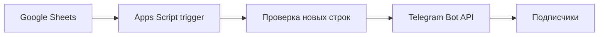

# Google Sheets Telegram Notifier

Небольшая автоматизация на Google Apps Script: отслеживает появление новых строк в Google Sheets и отправляет подписчикам Telegram ссылку на добавленную запись.

## Что реализовано

- проверка новых строк по расписанию;
- сохранение последней обработанной строки в Script Properties;
- подписка пользователей по команде `/start`;
- рассылка уведомления всем подписчикам;
- прямая ссылка на новую строку таблицы;
- блокировка параллельных запусков через `LockService`;
- логирование ошибок Telegram API;
- хранение токена и параметров таблицы вне исходного кода.

## Схема

## Настройка

В разделе **Project Settings - Script Properties** добавьте:

| Ключ | Значение |
|---|---|
| `TELEGRAM_TOKEN` | токен Telegram-бота |
| `SHEET_ID` | идентификатор таблицы |
| `SHEET_NAME` | название листа |
| `SHEET_GID` | идентификатор листа |

Затем создайте два time-driven trigger:

- `checkNewRows` - проверка новых строк;
- `getUpdates` - обработка команды `/start`.

## Безопасность

Не размещайте токен бота, рабочие идентификаторы таблиц и данные подписчиков в публичном репозитории. Для секретов используется `PropertiesService.getScriptProperties()`.

## Стек

`Google Apps Script`, `Google Sheets API`, `Telegram Bot API`, `JavaScript`.
